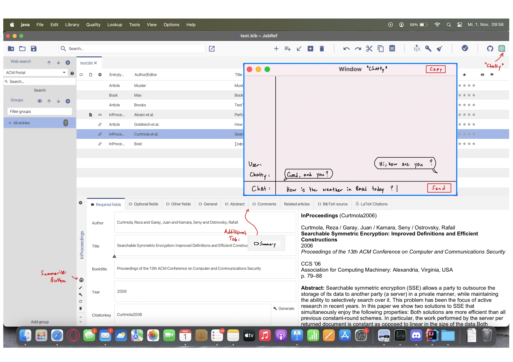

# Pflichtenheft: ChatGPT Einbindung
#####  (Nach Lichter & Ludwig, Software Engineering: Grundlagen, Menschen, Prozesse, Techniken)

## 1. Einleitung

### 1.1 Zweck

Dieses Dokument dient als eine Beschreibung von den Anforderungen, Funktionen und Spezifikationen unserer Erweiterung von Jabref. Es dient als eine Grundlage für Design, Entwicklung und Qualitätssicherung.

### 1.2 Einsatzbereich und Ziele

Die Modifikation richtet sich an JabRef-User, die mit vielen Einträgen arbeiten und die Übersicht schnell verlieren. Die Modifikation richtet sich auch an diejenigen, die mit ChatGPT schreiben möchten, oder eine Frage schnell beantwortet haben möchten. Potenzielles Einsatzgebiet sind also alle User von JabRef.

Neue Funktionen:

* Abstracts werden auf Knopfdruck in einem Satz zusammengefasst.
* Integrierter Zugang zu ChatGPT über ein Chat-Window.

### 1.3 Definitionen

| Begriff  	 | Bedeutung 	                                                                                                                                                                                                                                  |
|------------|----------------------------------------------------------------------------------------------------------------------------------------------------------------------------------------------------------------------------------------------|
| API      	 | Eine API ist eine Schnittstelle, die es unabhängigen Anwendungen ermöglicht, miteinander zu kommunizieren und Daten auszutauschen         	                                                                                                  |
| Abstract 	 | Unter dem englischen Begriff Abstract versteht man eine prägnante Zusammenfassung bzw. Inhaltsangabe, einen Abriss ohne Interpretation und Wertung einer wissenschaftlichen Arbeit                                                           |
| ChatGPT  	 | ChatGPT ist ein Chatbot, der künstliche Intelligenz einsetzt, um mit Nutzern über textbasierte Nachrichten zu kommunizieren                                                                                                                  |
| API-Key    | Aus dem Englischen übersetzt - Ein Anwendungsprogrammierschnittstellenschlüssel ist eine eindeutige Kennung, die verwendet wird, um einen Benutzer, Entwickler oder ein Aufrufprogramm für eine API zu authentifizieren und zu autorisieren. |

### 1.4 Überblick

Im folgenden Kapitel 2 wird die Spezifikation und ihre Einbettung genauer beschrieben. In Kapitel 3 werden alle
funktionalen Anforderungen an die Erweiterung detailliert ausgeführt und in Kapitel 4 wird definiert, was die Abnahmekriterien sind.

## 2. Allgemeine Beschreibung

### 2.1 Einbettung

ChatGPT 3.5-Turbo soll mittels API in Jabref eingebaut werden.

### 2.2 Funktionen

Die Nutzer greifen auf die Funktionalität von Chat-GPT via GUI zu. Bevor man ChatGPT benutzen kann, muss man eine aktive Internetverbindung haben und einen API-Schlüssel hinterlegt haben.
Den API Key kann der Nutzer via die Menuleiste `Tools -> Set API-Key` ändern. Daraufhin erscheint ein Textfeld, wo man den neuen Key eingeben kann.
Es kann mittels eines Buttons ein Chat-Window geöffnet werden, welches unterhaltsame Gespräche mit ChatGPT ermöglicht. Der aktuelle Kontext des Gesprächs bleibt erhalten, solange das Fenster geöffnet bleibt.
Beim Hinzufügen eines Artikels soll Chat-GPT via Knopfdruck den Abstract in einem Satz zusammenfassen.

### 2.3 Benutzerprofile

Alle Jabref Benutzer unabhängig vom Erfahrungslevel, die einen gültigen API-key für ChatGPT besitzen.
Benutzer müssen sich mit der englischen Sprache auskennen, da ChatGPT primär auf Englisch trainiert wurde, und andere Sprachen bisher nur als Vorschau verfügbar sind.

### 2.4 Einschränkungen
Für die Entwicklung verwenden wir JDK 19.0.2+7
- Die Erweiterung soll keine zusätzlichen Anforderungen an die Hardwarespezifikation erzeugen.
- Die Erweiterung ist abhängig von der verwendeten ChatGPT API und der aktuellen ChatGPT Version.
  Ausserdem ist sie abhängig vom gegebenen Abstract der einzelnen Einträge.
- Die Chat-GPT Benutzung ist nur mit seinem eigenen API-Schlüssel möglich. (siehe /F10/ für mehr Information)

### 2.5 Abhängigkeiten
Abhängigkeiten:
* Java 19.0.2+7
* ChatGPT 3.5-Turbo API

## 3. Einzelanforderungen

* /F10/ Es muss in der oberen Menuleiste unter Tools eine neue Option namens `Set API-key` geben.
* /F11/ Bei Tätigung muss ein Fenster aufgehen, mit einem Text-input Feld. Der User kann dort seinen eigenen API-Schlüssel eingeben und mit `OK` bestätigen.
* /F12/ Wenn kein API-Schlüssel angegeben wird, soll bei jedem Nutzungsversuch von den folgenden Funktionen (/F2X/ & /F3X/) eine Fehlernachricht kommen, welche den Benutzer (mit einer Anleitung) bittet, einen API-Schlüssel anzugeben.
* /F13/ Wenn keine aktive Interneverbindung vorhanden ist, soll bei jedem Nutzungsversuch von den folgenden Funktionen (/F2X/ & /F3X/) eine Fehlernachricht kommen, welche den Benutzer bittet, die Internetverbindung zu überprüfen.
* /F14/ Der API-Schlüssel muss in einer Text-Datei lokal gespeichert werden und erhalten bleiben beim nächsten Start von JabRef.
* /F15/ Der Benutzer soll jederzeit einen neuen API-Schlüssel angeben können. Der alte API-Schlüssel soll dabei überschrieben werden.
* /F20/ Es muss ein Tab rechts von `Abstract` mit dem Namen "Summary" existieren. (Siehe Mockup)
* /F21/ Links im unteren Feld, oberhalb vom `Change entry type` Button muss ein neuer Button namens "Summarize" erstellt werden. (Siehe Mockup)
* /F22/ Beim Betätigen des Buttons `Summarize` soll der Abstract über die offizielle OpenAI API an ChatGPT geschickt werden, mit der Aufgabe den Abstract in einem Satz zusammenzufassen.
* /F23/ Der Output des API-calls soll im Tab `Summary` dargestellt werden.
* /F24/ Sofern kein Abstract vorhanden ist, soll bei Betätigung des `Summarize` Buttons im Textfeld des `Summary` Tabs "No Abstract provided" stehen.
* /F30/ Oben rechts bei JabRef muss ein Button eingebettet werden mit der Aufschrift `Chatty`. (Siehe Grafik: GUI Mockup)
* /F31/ Beim Klicken auf diesen Knopf muss sich ein Chat Fenster mit einem Textfeld öffnen.
* /F32/ Man muss im Textfeld schreiben können und beim Klicken des `Send`-Buttons muss der Inhalt an ChatGPT geschickt werden. Das Textfeld soll nach dem Abschicken der Nachricht wieder leer sein.
* /F33/ Es soll eine Antwort von ChatGPT als Chat-Nachricht zurückgeschickt und angezeigt werden.
* /F34/ ChatGPT soll den Kontext vom aktuellen Gespräch verstehen. Beim Schliessen vom Chat-Fenster geht der Kontext sowie der Chat-Verlauf verloren.
* /F35/ Es soll nur ein Chat-Fenster zum selben Zeitpunkt offen sein können.
* /F36/ Oben rechts im Chat-Fenster soll ein Button eingebettet werden: `Copy`; wenn man diesen drückt soll die letzte Antwort von ChatGPT ins Clipboard kopiert werden.

## 4. Abnahmekriterien

* /A10/ Beim Klicken auf den "Set API-key" Button erscheint ein Fenster, indem der Benutzer seinen API-Schlüssel setzen kann.
* /A20/ Beim Klicken auf den "Summarize" Button erscheint eine Zusammenfassung des Abstracts in einem Satz im "Summary" Tab, sofern der Abstract existiert.
* /A30/ Beim Klicken auf den Button "Chatty", öffnet sich ein Chat-window, in dem man mit ChatGPT kommunizieren kann.

# Anhang

## Anhang A. Use-cases

### Use Case 1:
* Name: Durchschnittlicher User
* Akteure: Otto Normal (O.N.)
* Vorbedingungen: Otto Normal benutzt JabRef. Er hat kein Interesse daran, ChatGPT zu nutzen, sondern will JabRef 'normal' benutzen. Er möchte jedoch nicht jedes Mal den kompletten Abstract lesen müssen, um eine Vorstellung vom Inhalt des Artikels zu kriegen, aber trotzdem etwas mehr Informationen dazu erhalten, um einen Kurzüberblick über die Thematik des Artikels zu erlangen.
* Standardablauf
    * O.N. startet JabRef
    * O.N. Setzt seinen API-Schlüssel.
    * O.N. wählt einen Eintrag in seiner Bibliothek aus
    * O.N. klickt auf das "Summary" Tab (neben "Abstract" Tab)
    * O.N. klickt auf den "Summarize" Button (unten links, beim "Change entry type" Button)
* Nachbedingungen Erfolg: O.N. liest die Zusammenfassung des Abstracts in einem Satz.
* Nachbedingung Sonderfall 1a: Das Feld ist leer.
* Nachbedingung Sonderfall 1b: O.N. liest die Zusammenfassung des Abstracts in einem Satz.

#### Sonderfall 1a: Ausnahme 1
Wenn der Artikel keinen Abstract hat; beziehungsweise ein Eintrag ohne Abstract hinzugefügt wurde, bleibt das Feld leer (Analog zum "Abstract" Feld).
#### Sonderfall 1b: Ausnahme 2
Falls O.N. die Schritte (3) und (4) im obigen Ablauf vertauscht, also zuerst auf den "Refresh" Button und danach auf das "Summary" Tab klickt, erscheint ebenfalls die Zusammenfassung.

### Use Case 2:
* Name: ChatGPT User
* Akteure: Chatty
* Vorbedingungen: Chatty benutzt JabRef. Beim Browsen seiner Bibliothek fällt ihm eine Frage ein, die er gerne von ChatGPT beantwortet hätte. Dafür möchte er nicht auf seinen Internetbrowser wechseln, sondern das in JabRef integrierte Chat-Window nutzen.
* Standardablauf
    * Chatty startet JabRef
    * Chatty fällt eine Frage ein und möchte diese von ChatGPT beantwortet kriegen.
    * Chatty klickt auf den "Chatty" Button oben rechts und ein Fenster öffnet sich.
    * Chatty schreibt seine Frage in das Fenster und sendet seine Frage an ChatGPT.
    * Chatty erhält eine Antwort von ChatGPT im Fenster.
    * Chatty kopiert die Antwort, für spätere Benutzung, ins Clipboard indem er auf den `Copy` Button klickt.
* Nachbedingungen Erfolg: Chatty hat die gewünschte Antwort von ChatGPT erhalten.

### Use Case 3:
* Name: Hans hinter dem Mond
* Akteure: Hans hinter dem Mond (H.M.)
* Vorbedingungen: H.M. Hat keine aktive Internetverbindung oder keinen aktiven API-Schlüssel.
* Standardablauf
    * H.M. startet JabRef
    * H.M. betätigt versehentlich eine Funktionalität, die die API benötigt (Summarize Button oder Chatty Button).
    * H.M. wird mit Fehlermeldungen in einem Pop-up-Fenster darauf hingewiesen, einen API-schlüssel zu setzen, oder die Internetverbindung zu überprüfen.
* Nachbedingungen: H.M. macht nichts und kann die Funktionalitäten weiterhin nicht benutzen.
