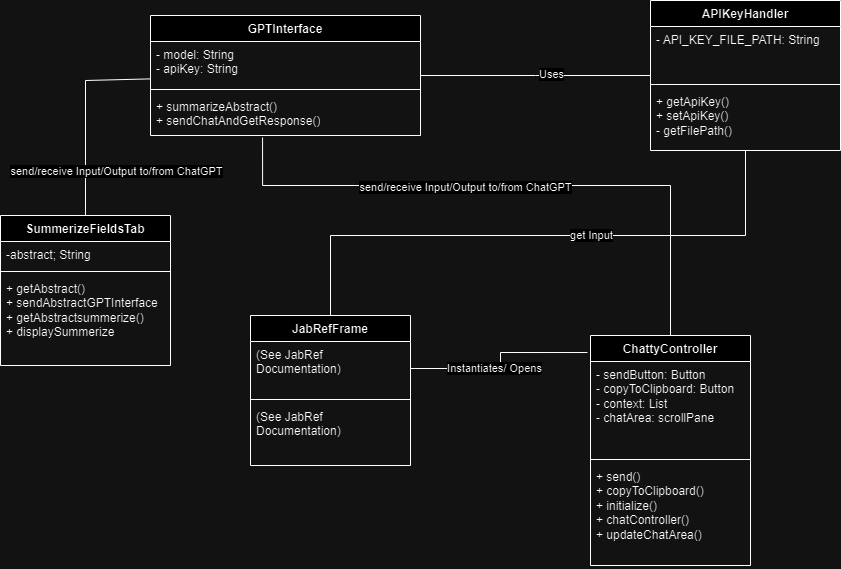
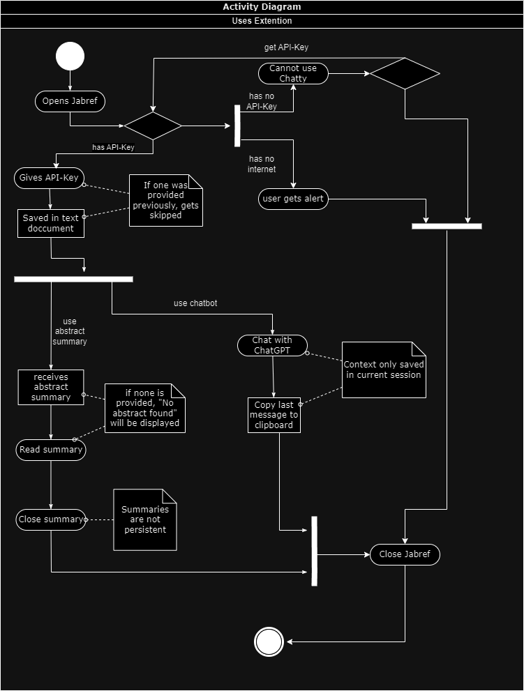
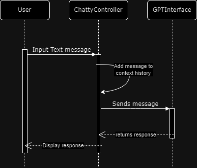
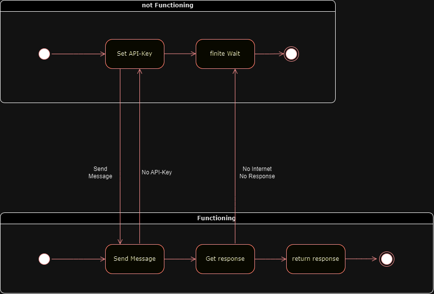

# Technische Dokumentation

| Version | Projektname | Autor                          | Status | Datum      | Kommentar |
|---------|-------------|--------------------------------| ------ |------------| --------- |
| 1.1     | Chatty      | Michel R., Severin M., Yash T. | in Bearbeitung | 12.11.2023 | |

# 1 Einführung

# 1.1 Zweck

Der Zweck dieses Dokuments ist es, eine Übersicht über die technischen Spezifikationen unserer JabRef Erweiterung zu geben. Es richtet sich einerseits an die Autoren selbst, andererseits auch an die zugewiesenen Betreuungspersonen.

# 1.2 Beziehung zu anderen Dokumenten

Andere relevante Dokumente umfassen das [Pflichtenheft](https://github.com/smemmishofer/jabref/blob/requirements/docs/sweng/Pflichtenheft.md), an dem sich dieses Dokument orientiert.

# 2. Systemübersicht

Die in diesem Dokument beschriebene Software ist eine Erweiterung von JabRef. Sie umfasst folgende Funktionen:
1. Der User kann seinen eigenen API-Key hinterlegen für die Benutzung der ChatGPT Funktionalität.
2. Es gibt einen Button, der den Abstract von ChatGPT kurz und prägnant zusammenfassen lässt und diesen in einem neuen Tab darstellt.
3. Der User hat die Möglichkeit ein in JabRef integriertes ChatWindow zu öffnen, um direkt mit ChatGPT zu kommunizieren. In diesem Chat soll der Kontext für die Dauer der Konversation gespeichert werden und ein Button für das direkte Kopieren der letzten Antwort ins Clipboard existieren.

Für genauere Details Siehe [Pflichtenheft](https://github.com/smemmishofer/jabref/blob/requirements/docs/sweng/Pflichtenheft.md).

# 3. Designziele

* Aufgrund der geringen Abhängigkeit von bestehenden JabRef Funktionalitäten sollen grössere Änderungen in neuen Klassen implementiert werden.
* Dadurch soll die Komplexität von JabRef selbst nur minimal erhöht werden und die Erweiterung soll die bestehende JabRef Funktionalität nicht beeinträchtigen.
* Das GUI für die Zusammenfassung des Abstracts soll sich am bestehenden JabRef GUI orientieren, während das GUI für das ChatWindow in eigene Klassen mit View (FXML) und Controller eingebettet wird.
* Die Kommunikation mit ChatGPT soll ebenfalls in eigenen neuen Klassen geschehen.

# 4. Systemverhalten

Um die Designlösung die nachfolgend beschrieben wird einzuführen, sollten an dieser Stelle nochmals das gewünschte Verhalten des Systems (abgeleitet aus dem Pflichtenheft) kurz beschrieben werden.
Idealerweise sollte hier genügend Information gegeben werden, so dass man die Diagramme und Spezifikationen die im nächsten Abschnitt beschrieben werden verstehen kann, ohne zuvor das Pflichtenheft im Detail gelesen zu haben.

Unsere JabRef Erweiterung soll ChatGPT über die API von `OpenAI`einbinden. Das System soll sich wie folgt verhalten:
* Der User soll über das Menu `Tools -> Set API-key` einen API Key für ChatGPT hinterlegen können. Dieser Key wird gespeichert und muss beim nächsten Start von JabRef nicht neu hinzugefügt werden.
Falls kein gültiger API-key hinterlegt ist, wird bei jedem Versuch, eine der nachfolgenden Funktionen zu nutzen, eine Fehlermeldung ausgegeben. 
Ausserdem gibt es auch eine Fehlermeldung, wenn keine aktive Internetverbindung vorhanden ist; da diese für die ChatGPT Funktionalität essenziell ist.
* Der User kann nach Eingabe des API-keys durch Drücken des `Summarize` Buttons (Position Siehe Mockup Pflichtenheft) den Abstract (sofern vorhanden) in einem Satz zusammenfassen lassen.
Dieser wird im Tab `Summary` neben dem `Abstract` Tab dargestellt.
* Der User kann oben rechts (Siehe Mockup) auf den Knopf `Chatty` klicken, worauf sich ein ChatWindow mit ChatGPT öffnet. Man kann ChatGPT wie gewohnt verwenden und kriegt jeweils eine Antwort zurück.
Im Verlauf der Konversation wird der Kontext gespeichert. Bei jedem neuen Öffnen des Fensters wird der Kontext wieder zurückgesetzt.
Ausserdem existiert ein zusätzlicher Button `Copy`, der die letzte Antwort von ChatGPT in die Zwischenablage kopiert.

# 5. Design

Das Design unserer Erweiterung haben wir in 3 Teile aufgeteilt; was auch weitestgehend der Teilung der Verantwortlichkeiten unter den Gruppenmitgliedern entspricht. 
In den weiteren Sektionen dieses Kapitels werden wir genauer auf diese Aspekte eingehen.
* Eingabe und Speicherung des API-keys; Schicken der Nachrichten an die ChatGPT API und Empfangen der Antwort ("Backend")
* Funktionalität des `Summarize` Buttons und Einbindung in das bestehende JabRef GUI
* Design des ChatWindows, inklusive Funktionalität wie Kontext und `Copy` Button.

## 5.1 Statik

Die statischen Aspekte stellen wir mithilfe eines UML Klassendiagramms dar: 

## 5.2 Dynamik

Für die Illustration der dynamischen Aspekte haben wir folgende Diagramme verwendet:

Aktivitätsdiagramm: (ganzes System)

Sequenzdiagramm: (Interaktion User, ChattyController, GPTInterface)

Zustandsdiagramm: (GPTInterface)

## 5.3 Logik

Folgende logische Einschränkungen sind gegeben:

Es kann nur ein API-Key für ChatGPT angegeben werden. Nach dem Setzen des API-Keys ist das Field non-empty.
Der API-Key wird bei jedem Aufruf der Methoden GPTinterface.sendChatAndGetResponse() und GPTinterface.summarizeAbstract() neu geladen.
Der API-Key wird immer von der ersten Zeile des api-key.txt Dokuments gelesen.

Bei jedem Senden einer Nachricht an ChatGPT soll der Kontext um eine Nachricht ergänzt (länger) werden. 
Ebenso bei jeder Antwort von der ChatGPT API. Der Kontext kann nicht kürzer werden; ausser wenn das Fenster geschlossen wird.
Mit der von im Projekt verwendeten ChatGPT Version (3.5-Turbo) ist der Kontext auf 16'000 Zeichen beschränkt. Die Anzahl an Nachrichten im Kontext ist nicht-negativ.
Nach dem Betätigen des `CopyToClipboard Buttons; stimmt der Inhalt des Clipboards mit der letzten Nachricht von ChatGPT überein.

Ein leerer Abstract kann nicht zusammengefasst werden. Die Zusammenfassung des Abstracts ist kürzer, als der Abstract selber.

